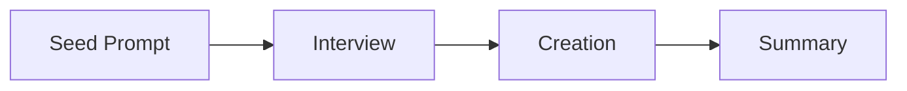

This artifact captures the design state of the generation pipeline. The governing principle is assembly-line orchestration — a seed prompt bootstraps an expert interview that drives automated creation of all agents, skills, instructions, and prompts through a pipeline of specialized agents.

<workflow_overview>

**End-to-end flow:**

1. User fills seed prompt (`init-interview.prompt.md`) — name, area, goal, tech, sources + free prose description
2. User runs the prompt — `@interviewer` activates
3. `@interviewer` conducts 4-round expert interview (understand → explore artifacts → boundaries → propose)
4. User approves artifact proposal
5. `@interviewer` writes spec files + manifest to `.github/specs/`
6. `@master` creates `output/[PROJECT_NAME]/.github/` structure
7. `@master` reads manifest, spawns `@creator` per artifact
8. `@creator` selects correct skill per artifact type, executes the skill, creates artifact file
9. `@master` compiles results, validates
10. `@master` generates project-wide `copilot-instructions.md` directly in summarize mode
11. `[PLANNED]` `@master` creates `README.md` with overview and usage examples

</workflow_overview>

<phase_1_seed>

**Actor:** User

**Action:** Fill a minimal seed prompt and run it. The seed prompt captures just enough structured data to bootstrap the interview. The interview is the primary knowledge source, not the seed prompt.

**Input:** Seed prompt — `.github/prompts/init-interview.prompt.md`

**Output:** Filled seed prompt (`.prompt.md`) — user runs this to start the interview

**Structured fields (~5, in YAML frontmatter):**

1. **name** [REQUIRED] — project name
2. **area** [REQUIRED] — domain area (e.g., web app, CLI tool, data pipeline)
3. **goal** [REQUIRED] — what the project should accomplish
4. **tech** [REQUIRED] — languages, frameworks, tools (comma-separated or list)
5. **sources** (optional) — url+title pairs for reference material

**Free prose `<description>` section:** Business context, problems solved, rules, domain concepts, anything relevant. No structure imposed — user writes naturally.

**UX:** User fills in ~30 seconds and runs the prompt. The prompt invokes `@interviewer` with the seed data.

</phase_1_seed>

<phase_2_interview>

**Actor:** `@interviewer` agent

**Input:** Seed prompt data (structured fields + free prose description)

**Interview pattern — 4-round expert interview:**

The interview is the primary knowledge source. `@interviewer` is an expert interviewer who drives discovery through conversation, not a form parser.

**Round 1 — Understand project:**

1. Read seed prompt data (name, area, goal, tech, description)
2. Dig into the description — ask clarifying questions about business context, problems, and domain
3. Build mental model of what the project needs

**Round 2 — Explore artifact opportunities:**

4. Probe for artifact needs through conversation:
   - Processes and automation → agents + skills
   - Conventions and standards → instructions
   - One-off parameterized tasks → prompts
5. Ask targeted questions to uncover needs the user has not articulated

**Round 3 — Boundaries and safety:**

6. Explore constraints, boundaries, and safety considerations
7. Identify what agents should NOT do, sensitive areas, approval requirements

**Round 4 — Confirm and propose:**

8. Present a flat artifact list with 1-2 sentence justification per artifact: "Based on our conversation, I recommend: 3 agents, 2 skills, 4 instructions, 1 prompt"
9. User can approve, add, or remove artifacts — no artifact internals exposed at this stage
10. Write individual spec files (one per artifact, YAML format)
11. Write a manifest index listing all artifacts with paths to spec files
12. Hand off to `@master` with manifest path

**Output:**

- Manifest file (artifact list with paths to spec files)
- N spec files (one per artifact, each containing everything the creator skill needs)

</phase_2_interview>

<phase_3_creation>

**Actor:** `@master` agent (orchestrator)

**Input:** Manifest file from `@interviewer`

**Actions:**

1. Read manifest — list of all artifacts to create with paths to spec files
2. Create `output/[PROJECT_NAME]/.github/` directory structure
3. For each artifact: spawn one generic `@creator` subagent with the spec file path
4. `@creator` reads the spec → determines artifact type from `artifact_type` field → selects correct skill dynamically (agent-creator, prompt-creator, instruction-creator, or skill-creator) → executes the skill → creates the artifact file in `output/[PROJECT_NAME]/.github/` → returns summary + path to `@master`
5. `@master` tracks progress: which artifacts succeeded, which encountered errors

**Output:** Created artifact files (`.agent.md`, `.prompt.md`, `.instructions.md`, `SKILL.md`)

</phase_3_creation>

<phase_4_summary>

**Actor:** `@master` agent

**Input:** Results from all `@creator` runs

**Actions:**

1. Compile creation results
2. Run programmatic validation on each created artifact (optional)
3. Present summary to user: list of created artifacts, any errors, recommended next steps

**Output:** Summary report to user — project artifacts at `output/[PROJECT_NAME]/.github/`

</phase_4_summary>
