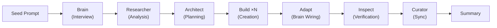
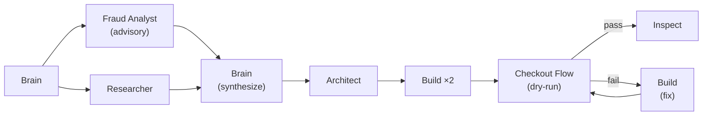
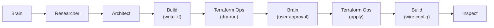
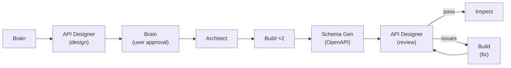

This artifact captures the design rationale for running generation through core hub-and-spoke agents. The governing principle is: generation is a standard @brain-orchestrated workflow — no dedicated generation agents exist. The workflow transforms a minimal seed prompt into a complete project workspace using the same agents that handle every other task: @brain drives interview, @researcher analyzes, @architect plans, @build creates, @inspect verifies, @curator syncs. The workflow's deliverable is a self-contained `.github/` folder ready to drop into any project. All generation knowledge lives in the prompt file (`init-project.prompt.md`), not in dedicated agents.


<workflow_overview>



**End-to-end flow:**

1. User fills seed prompt (`init-project.prompt.md`) — name, area, goal, tech, sources + free prose description
2. User runs the prompt — @brain activates
3. @brain conducts 3-round interview via askQuestions (understand → explore → boundaries+propose)
4. User approves artifact proposal
5. @brain spawns @researcher with seed + interview data for analysis
6. @brain sends approved artifacts → @architect for phased creation planning
7. @architect produces plan with creation tasks (skill per artifact, output paths, requirements)
8. @build instances (parallel per phase) create artifacts using skills, copy templates
9. @build adapts copied brain.agent.md — injects domain agent entries into `<agent_pool>` and `<spawn_templates>`. Generates project-specific `copilot-instructions.md` and `.curator-scope`
10. @inspect verifies all created artifacts against plan criteria
11. @curator syncs workspace docs
12. @brain presents summary to user

</workflow_overview>


<dissolution_rationale>

The previous model used three generation-specific agents — @interviewer, @master, @creator — that duplicated capabilities already present in core spokes. Each generation agent mapped directly to an existing spoke with no unique capability justifying its existence.

- **@interviewer → @brain** — @brain already handles all user interaction through askQuestions. Interview expertise (question patterns, artifact heuristics, profile assignment) is domain knowledge, not agent identity — it belongs in a prompt file, not a separate agent
- **@master → @brain + @architect** — @master combined orchestration and planning. @brain already orchestrates all workflows; @architect already produces phased plans from direction input. Splitting these responsibilities to existing spokes eliminates a redundant coordinator
- **@creator → @build** — @creator selected a skill per artifact type and executed it. @build already creates files and loads skills directly. The skill selection logic moves into @architect plan tasks, where each task specifies which skill to use

**Benefits of dissolution:**

- Single orchestrator (@brain) — no parallel coordination between @brain and @master
- Full quality loop — @inspect and @curator participate in generation, which the previous model skipped entirely
- Fewer agents to maintain — three agent definitions, their contracts, and their handoff protocols are eliminated
- Consistent error handling — generation errors follow the same escalation path as every other workflow

</dissolution_rationale>


<knowledge_redistribution>

Every capability from the dissolved agents redistributes to an existing component. Nothing is lost — knowledge moves, agents disappear.

**Moved to `init-project.prompt.md`:**

- Interview expertise — artifact heuristics, profile assignment, question patterns (from @interviewer)
- Spec field definitions — what to collect per artifact type during interview (from @interviewer)
- Orchestration design patterns — entry points, workflows, handoffs (from @master)
- Skill selection mapping — which skill handles which artifact type (from @master + @creator)

**Moved to @architect plan tasks:**

- Skill selection per artifact — each plan task specifies the skill to load (from @creator)
- Output path assignment — each task specifies where artifacts land (from @master)

**Moved to @build task execution:**

- Source fetching — @build fetches reference material per plan instructions (from @creator)
- Template copying — @build copies templates per plan instructions (from @master)
- `copilot-instructions.md` generation — @build creates as a plan task (from @master)

**Deleted (absorbed into prompt):**

- `spec-schema.md` — spec field structure absorbed into prompt interview rules
- `manifest-schema.md` — manifest structure eliminated; data flows in-memory through @brain

</knowledge_redistribution>


<phases>

Brief description of each generation phase and which spoke handles it.

- **Phase 1 — Seed** — User fills `init-project.prompt.md` with structured fields (name, area, goal, tech, sources) and free prose description. No agent involvement — user input only
- **Phase 2 — Interview** — @brain drives a 3-round interview via askQuestions: understand project → explore artifact opportunities → boundaries + propose. @researcher supplements with seed analysis when spawned by @brain after interview concludes
- **Phase 3 — Planning** — @architect receives interview data and artifact list as direction input, produces a phased creation plan. Each task specifies: artifact type, skill to load, output path, requirements, and success criteria
- **Phase 4a — Creation** — @build instances execute in parallel per phase. Each instance loads the skill specified in its plan task, creates the artifact, copies templates as needed. Multiple @build instances run concurrently within a single phase
- **Phase 4b — Adaptation** — Runs as a final @build task after all domain artifacts exist. Brain adaptation injects domain agent entries into `<agent_pool>` and `<spawn_templates>` of copied brain.agent.md. `copilot-instructions.md` generation produces project workspace map, constraints, development commands, and agent listing. `.curator-scope` generation produces include/exclude patterns for edit boundaries
- **Phase 5 — Verification** — @inspect checks all created artifacts against the plan's success criteria. Findings return to @brain for rework decisions
- **Phase 6 — Summary** — @brain compiles creation results, verification outcomes, and any rework history into a summary presented to the user

</phases>


<integration_points>

Generation uses four integration points instead of three dedicated agents. Each point connects the generation workflow to the core hub-and-spoke system at a natural boundary.

1. **Entry** — `init-project.prompt.md` → @brain. The prompt file replaces @interviewer. It carries all interview expertise (question patterns, artifact heuristics, profile logic) as prompt instructions. When the user runs the prompt, @brain activates and conducts the interview using this embedded knowledge
2. **Planning** — @architect receives interview data as direction. This replaces @master's planning role. @brain passes the approved artifact list and interview context to @architect, which produces the same phased creation plan @master would have — but through the standard planning spoke
3. **Execution** — @build loads creator skills directly. This replaces @creator. Each plan task specifies which skill to load (agent-creator, artifact-author, skill-creator, instruction-creator, prompt-creator, copilot-instructions-creator), so @build needs no artifact-type routing logic — @architect's plan provides it
4. **Summary** — @brain compiles results and presents to user. This closes the generation workflow. @brain collects creation results from @build, verification outcomes from @inspect, and any rework history, then presents a structured summary to the user. No new integration is required — this uses @brain's existing return-to-user behavior

</integration_points>


<domain_agent_model>

Domain agents carry specialized intelligence that generic spokes lack. They don't replace @build — they advise it, review its output, or execute domain-specific procedures that require specialized safety gates. Their primary value is judgment, not file mutation.

<mutation_tiers>

- **Read-only** (Guide, Diagnostician, Analyst) — tools: search, read, web, askQuestions, execute (computation only). Safety: no mutation risk — iron_law prevents state modification. Relationship to @build: advisory — provides findings that @brain passes to @architect or @build via Context field. Example: @python-dev (Guide) recommends FastAPI DI patterns before @architect plans the refactor
- **Scoped-write** (Transformer, Curator) — tools: search, read, edit. Safety: bounded scope — Transformer validates input/output against schema, Curator preserves content fidelity with before/after verification. Relationship to @build: complementary — @build writes code, Transformer/Curator handle domain-specific asset transformations. Example: @schema-gen (Transformer) generates OpenAPI spec from annotated code
- **Safety-gated write** (Operator) — tools: search, read, execute with mandatory dry-run + rollback. Safety: procedural gates — iron_laws require dry-run before live execution, rollback path always available. Relationship to @build: sequential — @build creates migration scripts, Operator executes them with safety ceremony. Example: @db-migrator (Operator) executes migration with pre-flight checks, state verification, rollback on failure

</mutation_tiers>

<orchestration_positions>

1. Pre-research framing — Domain agent scopes the investigation before @researcher dives deep. Example: @security-analyst defines threat surface → @researcher investigates specific attack vectors
2. Parallel with @researcher — Domain agent runs alongside @researcher instances in the same spawn wave. Example: @api-designer evaluates API patterns while @researcher explores library options
3. Pre-planning advisory — Domain agent provides expertise that shapes @architect's plan. Example: @python-dev validates DI approach → findings become @architect Direction context
4. Within @architect plan — @architect names domain agent as a plan task that @brain spawns. Example: Plan Phase 2, Task 3: "Spawn @pandas-migrator on src/data/ files"
5. Post-build domain review — Domain agent reviews @build output before @inspect's generic quality gate. Example: @python-dev checks PEP compliance and framework anti-patterns on completed auth module
6. Post-inspect domain gate — Additional domain-specific verification after @inspect PASS. Example: @compliance-analyst checks regulatory requirements before release
7. Standalone — @brain spawns domain agent directly for a focused question, no build cycle. Example: User asks "what's the best pytest fixture pattern?" → @brain spawns @python-dev → returns answer
8. Feedback loop to @build — Domain agent diagnoses issue, @brain routes fix to @build, cycle repeats. Example: @build-investigator finds root cause → @brain sends fix task to @build → @inspect verifies

</orchestration_positions>

<advisory_pattern>

The advisory pattern is the most common domain agent role. Domain agents produce structured findings following the @researcher output format: numbered findings with evidence, `[CONFLICT]`/`[OUT OF SCOPE]` markers, and explicit references. @brain passes these findings downstream via the Context field in spawn prompts — @architect receives them as Direction context, @build receives them as Task guidance. This creates a knowledge chain: domain expertise → @brain synthesis → @architect plan with domain-informed success criteria → @build execution with domain context → @inspect verification.

When multiple domain agents advise in parallel, @brain synthesizes their findings and resolves conflicts using the Safety → Accuracy → Clarity → Style priority chain. If agents give contradictory advice, @brain surfaces both positions with evidence and asks the user to decide.

Advisory agents participate in rework loops. When @inspect returns REWORK NEEDED, @brain can re-spawn advisory agents to provide updated guidance. The agent receives its prior findings in Context with a `Rework:` prefix, signaling re-investigation.

</advisory_pattern>

<reference_patterns>

For interview-use versions with collection guidance, see `<reference_patterns>` in [init-project.prompt.md](../prompts/init-project.prompt.md).

These patterns illustrate how domain agents compose with core spokes in real workflows. Each demonstrates a distinct orchestration signature — the combination of mutation tiers, insertion points, and artifact types that defines how a project's agents collaborate. They serve as design vocabulary for the generation interview.

<pattern name="E-commerce Platform">

**Composition:**

- @fraud-analyst (Analyst) — read-only, pre-planning advisory
- @checkout-flow (Operator) — safety-gated write, post-build dry-run
- checkout-conventions (instruction) — auto-loaded via `applyTo`

**Flow narrative:**

User requests adding discount code validation. @brain spawns @fraud-analyst in parallel with @researcher — analyst identifies abuse vectors and rate-limiting requirements while researcher maps the current checkout codebase. @brain synthesizes both into security-aware Direction for @architect. @architect plans 3 phases. @build instances create validation service and rate limiter. After build, @checkout-flow executes a dry-run of the full checkout pipeline with discount codes — if dry-run fails, @brain routes the fix to @build and re-runs @checkout-flow. On pass, @inspect does the generic quality gate.

**Key takeaway:** Two domain agents at different mutation tiers in one workflow — read-only Analyst advises pre-planning, safety-gated Operator validates post-build with a feedback loop.



</pattern>

<pattern name="Data Pipeline">

**Composition:**

- @terraform-ops (Operator) — appears twice at different safety levels
- terraform-patterns (instruction) — auto-loaded via `applyTo: '**/*.tf'`

**Flow narrative:**

User requests provisioning a new Kafka cluster. @brain spawns @researcher to map current infrastructure. @architect plans 2 phases. @build writes Terraform modules — the terraform-patterns instruction auto-loads via applyTo and silently enforces naming and structure conventions. @terraform-ops runs `terraform plan` as a read-only dry-run to verify. @brain pauses to ask user approval. On approval, @terraform-ops runs `terraform apply` with health checks and rollback capability. @build then wires the Kafka connection in application config. @inspect verifies, @curator syncs infrastructure docs.

**Key takeaway:** Same domain agent at two safety levels — dry-run (read-only) then apply (safety-gated) with a human-in-the-loop approval gate mediated by @brain. Instruction silently shapes @build output without explicit routing.



</pattern>

<pattern name="API Platform">

**Composition:**

- @api-designer (Guide) — read-only, appears at two positions (standalone + post-build review)
- @schema-gen (Transformer) — scoped-write, generates OpenAPI spec
- api-conventions (instruction) — auto-loaded via `applyTo: '**/*controller*.ts'`

**Flow narrative:**

User requests designing and implementing a user management API. @brain spawns @api-designer standalone — it produces a complete API design (endpoints, versioning, pagination, error contract). @brain presents the design to the user for approval. On approval, @architect plans 3 phases. @build instances implement routes and auth middleware — api-conventions instruction auto-loads and enforces naming, response formats, and error codes. @schema-gen generates an OpenAPI spec from the annotated handlers. @api-designer returns for post-build review, checking implementation against its original design decisions. If issues found, @brain loops fixes through @build until @api-designer signs off. @inspect does the generic quality gate.

**Key takeaway:** Three artifact types composing — Guide at two orchestration positions (pre-planning standalone and post-build review), Transformer for specialized generation, instruction for silent convention enforcement.



</pattern>

</reference_patterns>

</domain_agent_model>


<output_model>

The generation workflow's deliverable is a self-contained `.github/` folder. When dropped into any repository, it provides a complete hub-and-spoke system with domain-specific agents, skills, instructions, and prompts — all wired to work together through platform discovery and explicit brain adaptation.

<output_structure>

```
.github/
├── agents/
│   ├── core/                          # Copied — 5 static + brain adapted
│   │   ├── brain.agent.md             ← injection markers for domain entries
│   │   ├── architect.agent.md         ← static copy
│   │   ├── build.agent.md             ← static copy
│   │   ├── inspect.agent.md           ← static copy
│   │   ├── curator.agent.md           ← static copy
│   │   └── researcher.agent.md        ← static copy
│   ├── {name-1}.agent.md              # Generated — domain agents (flat)
│   └── {name-2}.agent.md
├── skills/
│   ├── agent-creator/                 # Copied — enables project self-evolution
│   ├── artifact-author/               # Copied
│   ├── instruction-creator/           # Copied
│   ├── prompt-creator/                # Copied
│   ├── skill-creator/                 # Copied
│   ├── copilot-instructions-creator/  # Copied — generates workspace config
│   └── {domain-skill}/               # Generated — 0-N domain skill folders
│       ├── SKILL.md
│       └── references/
├── instructions/                      # Generated — 0-N domain instruction files
│   └── {name}.instructions.md
├── prompts/                           # Generated — 0-N domain prompt files
│   └── {name}.prompt.md
├── copilot-instructions.md            # Generated — via copilot-instructions-creator skill
└── .curator-scope                      # Generated — plain text, include/exclude globs
```

</output_structure>

<brain_adaptation>

- @brain is the only core agent that requires content modification. The other 5 core agents work as static copies — they receive all context from @brain's spawn prompts and from platform-injected instructions/skills
- The brain template contains two HTML comment markers that define injection points: `<!-- DOMAIN_AGENT_POOL -->` inside `<agent_pool>` (placed after the last core spoke entry) and `<!-- DOMAIN_SPAWN_TEMPLATES -->` inside `<spawn_templates>` (placed after the last core spoke example). During adaptation, @build locates these markers and inserts domain agent entries at those positions
- Adaptation targets two sections of brain.agent.md:
  - `<agent_pool>` — inject an entry per domain agent at the `<!-- DOMAIN_AGENT_POOL -->` marker using the established 3-field pattern: Strengths (behavioral capabilities), Tools (available tool list), Leverage (when/how @brain should spawn this agent)
  - `<spawn_templates>` — inject at least one domain agent spawn example at the `<!-- DOMAIN_SPAWN_TEMPLATES -->` marker showing the field name convention and realistic spawn prompt structure
- Why adaptation is necessary: VS Code's `agents: ['*']` grants @brain access to all agents, but access is not routing. Without `<agent_pool>` entries, @brain can technically spawn a domain agent but lacks the tactical intelligence to know WHEN to route to it, WHAT to include in the spawn prompt, and HOW to leverage its strengths. The pool entry transforms a discoverable agent into a routeable one
- Adaptation runs as a @build task after all domain artifacts are created — @build reads created domain agent files to extract their strengths, tools, and leverage patterns, then injects entries into the copied brain.agent.md

</brain_adaptation>

<companion_artifacts>

- `copilot-instructions.md` — generated via the copilot-instructions-creator skill from interview data + artifact proposal. Contains:
  - `<workspace>` — directory listing with all generated artifact paths and status markers
  - `<constraints>` — standard rules (trust documented structure, no fabrication) plus project-specific constraints derived from interview Round 3 (boundaries, safety, approval requirements)
  - `<decision_making>` — standard priority chain (Safety → Accuracy → Clarity → Style) and classification model (P1/P2/P3), copied verbatim
  - `<commands>` — project-specific development commands grouped by category (environment setup, build, test, lint/format, run, deploy) — collected during interview, mandatory when provided
  - Agent listing — all core + domain agents with descriptions, providing cross-agent awareness context
- `.curator-scope` — plain text file generated from artifact paths + interview boundaries. Format uses `include:` and `exclude:` sections containing glob patterns, one per line:
  - `include:` — domain agent paths (`.github/agents/*.agent.md`), instruction files (`.github/instructions/*.instructions.md`), skill SKILL.md files (`.github/skills/*/SKILL.md`), copilot-instructions.md (`.github/copilot-instructions.md`)
  - `exclude:` — project source directories (from interview), dependency directories (`node_modules/`, `.venv/`, `vendor/`, etc.), build output (`dist/`, `build/`, `out/`, etc.)
- Output path convention — all generated artifacts land under `output/{project-name}/.github/`

</companion_artifacts>

<platform_discovery>

- What VS Code handles automatically (no wiring needed):
  - Skills — platform scans `.github/skills/*/SKILL.md`, injects `<skills>` section into all agent system prompts with descriptions. Blocking requirement forces eager loading
  - Instructions — `applyTo` glob patterns in frontmatter auto-activate when matching files enter context. `copilot-instructions.md` injected into ALL requests
  - Prompts — platform surfaces `.prompt.md` files in the `/` picker, `agent:` field routes to correct agent
  - Agents — `agents: ['*']` on @brain discovers all `.agent.md` files in workspace. `user-invokable: false` + `agents: []` keeps domain agents as spokes only
- What requires explicit wiring (brain adaptation):
  - Routing intelligence — @brain needs `<agent_pool>` entries to know when, how, and why to spawn each domain agent. Platform discovery provides access; pool entries provide judgment

</platform_discovery>

</output_model>


<self_containment_contract>

The output project must pass a self-containment test before delivery. Each verification criterion maps to a specific mechanism in the output structure. Gaps in these criteria represent work the generation workflow must address.

- @brain can discover and route to all domain agents — mechanism: `agents: ['*']` for discovery + `<agent_pool>` entries for routing intelligence
- @architect can plan tasks involving domain skills — mechanism: platform-injected `<skills>` section provides skill awareness; @brain passes domain context in Direction
- @build can load and execute domain skills — mechanism: platform-injected `<skills>` section with blocking requirement triggers skill loading
- Instructions are correctly scoped — mechanism: `applyTo` frontmatter patterns match intended file types
- `copilot-instructions.md` accurately describes workspace — mechanism: generated via copilot-instructions-creator skill from artifact proposal, lists all paths and agents
- `.curator-scope` covers domain paths — mechanism: plain text file with `include:`/`exclude:` glob pattern sections generated from artifact paths + interview boundaries
- Project can self-evolve (create new artifacts) — mechanism: 6 creator skills copied to output project (agent-creator, artifact-author, instruction-creator, prompt-creator, skill-creator, copilot-instructions-creator)

Pipeline requirements the workflow must fulfill:

- Brain adaptation — locate `<!-- DOMAIN_AGENT_POOL -->` and `<!-- DOMAIN_SPAWN_TEMPLATES -->` injection markers in copied brain.agent.md and insert domain agent entries at those positions
- Skills directory scaffolding — create `.github/skills/{name}/` folder structure with `references/` and optional `assets/` for each domain skill
- Prompts directory scaffolding — ensure `.github/prompts/` exists in output with generated prompt files
- `.curator-scope` generation — generate plain text file with `include:` and `exclude:` sections containing glob patterns (one per line) from artifact paths + interview boundaries
- `copilot-instructions.md` generation — generate via copilot-instructions-creator skill; include all core + domain agents with descriptions
- Core agent templates — copy `.github/templates/agents/` for core agents; copy creator skill folders from `.github/skills/` (agent-creator, artifact-author, instruction-creator, prompt-creator, skill-creator, copilot-instructions-creator); generate domain artifacts from creator skills during the build phase
- Constraints population — map interview Round 3 safety answers into `<constraints>` bullet rules
- Creator skills — copy all 6 creator skill folders (agent-creator, artifact-author, instruction-creator, prompt-creator, skill-creator, copilot-instructions-creator) to output project for self-evolution capability
- `.github/templates/instructions/` is intentionally empty — instructions are interview-driven, generated per-project by instruction-creator skill

</self_containment_contract>
