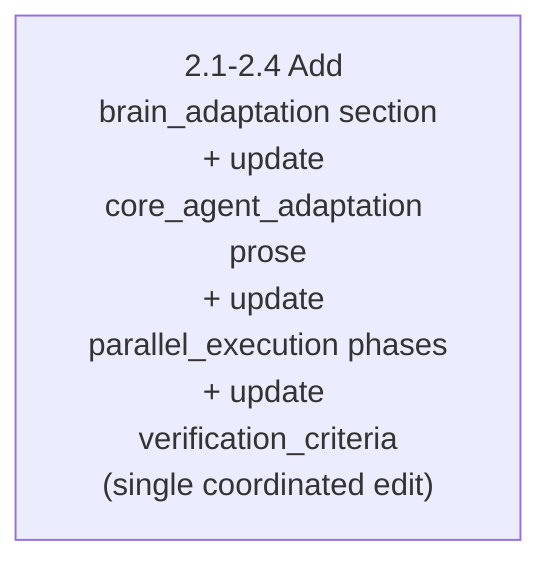
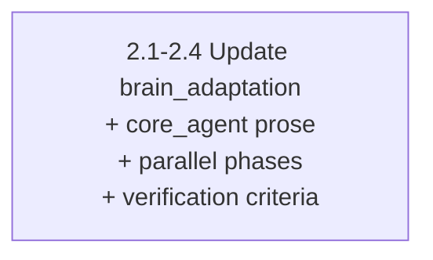

This skill produces Mermaid diagrams that render correctly and communicate clearly. The governing principle is clarity over density — keep nodes concise, use line breaks properly, and let layout breathe. Begin with `<step_1_select_type>` to choose the right diagram type.


<use_cases>

These patterns trigger skill activation during task routing.

- Visualize multi-phase plans as flowcharts with dependencies and decision gates
- Create sequence diagrams for agent-to-agent communication flows
- Draw state or class diagrams for lifecycle transitions or type hierarchies
- Add Mermaid diagrams to documentation or plan artifacts

</use_cases>


<workflow>

Execute steps sequentially. Each step builds on the previous — type selection determines syntax, structure drives layout, composition applies syntax rules, and styling adds polish before validation.


<step_1_select_type>

Match the content to the correct diagram type:

| Content pattern | Diagram type | Declaration |
|---|---|---|
| Phases, tasks, dependencies, decision gates | Flowchart | `flowchart TD` |
| Agent messages, request/response, activation | Sequence | `sequenceDiagram` |
| Lifecycle states, transitions, composites | State | `stateDiagram-v2` |
| Type hierarchies, relationships, interfaces | Class | `classDiagram` |

Use `TD` (top-down) for plan flowcharts, `LR` for process pipelines. Default to flowchart when uncertain.

</step_1_select_type>


<step_2_structure>

Design the diagram structure before writing syntax:

- **Group related nodes** into subgraphs: `subgraph id["Display Title"] ... end`
- **Keep labels ≤ 40 chars per line** — use `<br/>` for multi-line labels
- **Prefer descriptive edge labels** over overloaded node text
- **Invisible links** (`A ~~~ B`) for positioning; **extra dashes** (`A ---> B`) for longer spans
- **Elk renderer** (`defaultRenderer: "elk"`) for complex diagrams with 15+ nodes
- For plan flowcharts: one node per task group, edges show dependencies, subgraphs represent phases

</step_2_structure>


<step_3_compose>

Write the diagram using correct Mermaid syntax.

**Line breaks — critical rules:**

- ALWAYS use `<br/>` for line breaks in labels — most portable across all diagram types
- NEVER use `\n` — renders as literal text in flowcharts
- Markdown strings (`` "`...`" ``) support actual newlines but only in flowcharts

**Node shapes (flowchart):**

| Shape | Syntax | Use for |
|---|---|---|
| Rectangle | `[text]` | Standard tasks |
| Rounded | `(text)` | Start/end points |
| Diamond | `{text}` | Decision gates |

**Edges:** `A -->|label| B` (arrow+label), `A -.-> B` (dotted), `A ==> B` (thick). Use `["text"]` for labels with special characters or reserved words.

**Sequence diagrams:** `<br/>` works in messages, notes, and aliases. Wrap long messages via `config: { sequence: { wrap: true, width: 300 } }`. Activation: `A ->>+ B` / `B -->>- A`.

**State diagrams:** Transitions via `StateA --> StateB: event`. Composite: `state "Name" as s1 { ... }`. Fork/join: `state fork <<fork>>`.

</step_3_compose>


<step_4_style>

**Accessibility — always include:**

```
accTitle: Brief title for screen readers
accDescr: One-sentence description of what the diagram shows
```

**Styling:** Define classes with `classDef name fill:#hex,stroke:#hex;`, apply inline with `nodeId:::name`, style edges with `linkStyle N stroke:#hex,stroke-width:2px;` (0-based index).

**Config via frontmatter:** Set `theme` (`default`, `neutral`, `dark`, `forest`, `base`), `htmlLabels: true`, `useMaxWidth: true`. Only `base` supports `themeVariables`. ALWAYS use hex colors (`#ff0000`) — the engine rejects color names.

</step_4_style>


<step_5_validate>

Review the completed diagram against these checks before delivery:

- Every line break uses `<br/>` — zero `\n` inside any label or message
- All labels ≤ 40 chars per line
- No bare lowercase `end` — capitalize or wrap: `[End]`, `(End)`, `"End"`
- No `o` or `x` immediately after `---` — add a space: `A --- oB`
- Subgraphs linked from outside use the subgraph ID, not internal node IDs
- Entity codes have trailing semicolons: `#quot;`; commas in `stroke-dasharray` escaped with `\,`
- `accTitle` and `accDescr` present; colors in hex format
- Diagram renders without syntax errors when read linearly

</step_5_validate>

</workflow>


<common_pitfalls>

Known issues that cause rendering failures or visual defects:

- **`\n` in labels** — renders as literal text. ALWAYS use `<br/>`
- **Lowercase `end`** — breaks flowcharts, sequence, and state diagrams. Capitalize or wrap in quotes/brackets
- **`o`/`x` after `---`** — creates unintended edge markers. Add a space before the letter
- **Subgraph direction ignored** — linking to internal nodes overrides direction. Link to the subgraph ID
- **Color names in themes** — rejected by engine. Use hex values: `#ff0000`
- **Missing `;` in entity codes** — `#quot` without `;` breaks parsing
- **Overloaded nodes** — split into concise label + descriptive edge labels

<contrast_examples>

**Wrong** — `\n` line breaks and overloaded node:



**Right** — `<br/>` line breaks and concise label:



</contrast_examples>

</common_pitfalls>


<error_handling>

Recovery rules for common diagram authoring failures.

- If diagram type is unclear, default to flowchart — covers most plan visualization needs
- If a label exceeds 40 characters, split at the nearest logical boundary using `<br/>`
- If a node contains the word `end`, wrap in quotes or brackets: `["End"]`, `(End)`
- If colors do not render, verify hex format — replace color names with hex values
- If subgraph layout breaks, check for external links to internal nodes — redirect to subgraph ID

</error_handling>


<validation>

Every diagram must pass these checks before delivery.

**P1 (blocking):**

- Zero `\n` inside any label or message text
- No bare lowercase `end` as node text
- `accTitle` and `accDescr` present in every diagram
- Declaration matches content type (flowchart for plans, sequence for communication)

**P2 (quality):**

- Labels ≤ 40 chars per line; edge labels carry context over overloaded nodes
- Hex colors, not color names; frontmatter config, not deprecated directives

**P3 (polish):**

- Consistent shape usage (diamonds for decisions, rectangles for tasks)
- Subgraphs with descriptive titles; invisible links for layout adjustment

</validation>
