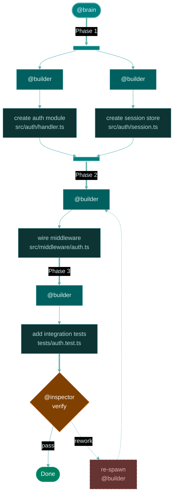

This skill creates plan visualization flowcharts for @brain. The governing principle is structure mirrors plan — every plan phase maps to a diagram region with fork-join bars for parallel work and thick sequential edges for chained phases. Begin with `<step_1_map>` to translate the planner's output into diagram structure.


<use_cases>

- Render a plan diagram after @planner delivers a `plan_template`
- Visualize workflow phases with parallel and sequential task groups
- Diagram task dependencies and agent delegation paths
- Show inspection gates and rework loops in multi-phase plans

</use_cases>


<workflow>

Execute steps sequentially. Each step produces structure that feeds the next — mapping determines topology, composition applies the B4 visual vocabulary, validation catches rendering pitfalls, and rendering produces the final output.


<step_1_map>

Translate the planner's `plan_template` phases into diagram topology:

- **`[parallel]` phase** — fork bar → N agent nodes (one per task) → N task nodes → join bar
- **`[sequential]` phase** — thick `==>|"Phase N"|` edge → agent node → task node(s) chained with `-->`
- **`Files:` field** — second line of task node label: `["action description<br/>target/file.path"]:::task`
- **`Depends on:` field** — edge from dependency's join bar or preceding task node
- **`@inspector` gate** — always appears after the last build phase as a diamond node
- **`@curator` phase** — appears after inspector passes, before Done

Only include agent nodes that are actually spawned — omit `@researcher` if no research phase exists, omit `@curator` if no curation phase.

</step_1_map>


<step_2_compose>

Build the diagram using the B4 visual vocabulary. Every diagram follows this skeleton:

1. Open with YAML config block (theme, dark mode, basis curve)
2. Declare `flowchart TD`
3. Place `(["@brain"]):::brain` at top
4. Map each phase from `<step_1_map>` into nodes and edges
5. Converge all phases at `{"@inspector<br/>verify"}:::gate`
6. Add pass edge to Done (or @curator), dotted rework edge back to builder
7. Close with `classDef` declarations and accessibility metadata

Consult `<visual_vocabulary>` for node shapes, edge types, and the color palette.

**Complete example — 3-phase plan (1 parallel, 2 sequential):**

````

````

</step_2_compose>


<step_3_validate>

Before delivery, verify every check against `<validation>` tiers. Fix all P1 issues — they block delivery. Fix P2 issues — they degrade quality. Flag P3 issues as suggestions.

Quick checklist:

- `accTitle` and `accDescr` present
- Zero `\n` anywhere — all line breaks use `<br/>`
- Labels ≤ 40 chars per line
- No bare lowercase `end` — capitalize or wrap: `["End"]`
- All colors in hex format — no color names
- Fork bars use `@{ shape: fork, label: " " }` with space label
- External links target subgraph IDs, not internal nodes
- Only spawned agents appear as nodes
- Theme config block present with `basis` curve and dark mode
- `classDef` declarations cover every `:::class` reference

</step_3_validate>


<step_4_render>

Render the completed diagram with `#tool:renderMermaidDiagram`. If rendering fails, check `<pitfalls>` for common causes, fix the syntax, and re-render.

</step_4_render>

</workflow>


<visual_vocabulary>

Complete reference for the B4 plan diagram pattern — node shapes, edge types, and teal monochrome palette.

**Node types:**

| Node | Syntax | Style class |
|---|---|---|
| Orchestrator | `(["@brain"]):::brain` | Stadium, teal primary |
| Builder spawn | `["@builder"]:::builder` | Rectangle, dark teal |
| Researcher spawn | `["@researcher"]:::researcher` | Rectangle, blue-teal |
| Planner spawn | `["@planner"]:::planner` | Rectangle, teal-green |
| Curator spawn | `["@curator"]:::curator` | Rectangle, muted teal |
| Task | `["action<br/>target/file.md"]:::task` | Rectangle, deepest teal |
| Inspection gate | `{"@inspector<br/>verify"}:::gate` | Diamond, burnt orange |
| Completion | `(["Done"]):::done` | Stadium, green-teal |
| Rework | `["re-spawn<br/>@builder"]:::rework` | Dashed rectangle, muted red |
| Fork/join bar | `@{ shape: fork, label: " " }` | Default |

**Edge types:**

| Edge | Syntax | Use for |
|---|---|---|
| Phase transition | `==>` or `==>\|"Phase N"\|` | Critical path, sequential flow between phases |
| Agent-to-task | `-->` or `-->\|"label"\|` | Normal connections within a phase |
| Rework loop | `-.->` or `-.->\|"rework"\|` | Feedback from inspector back to builder |

**Color palette (teal monochrome from `#008080`):**

```
classDef brain fill:#008080,stroke:#66b2b2,color:#e0f0f0,stroke-width:2px
classDef builder fill:#005f5f,stroke:#66b2b2,color:#e0f0f0
classDef researcher fill:#006080,stroke:#4d9999,color:#e0f0f0
classDef planner fill:#005f6a,stroke:#4d9999,color:#e0f0f0
classDef task fill:#0d3333,stroke:#4d9999,color:#b2d8d8
classDef gate fill:#804000,stroke:#cc8040,color:#fff
classDef done fill:#008060,stroke:#00a67a,color:#fff
classDef curator fill:#336666,stroke:#4d9999,color:#e0f0f0
classDef rework fill:#663333,stroke:#996666,color:#e0b2b2,stroke-dasharray:5 5
```

**Theme config (include in every diagram):**

```yaml
config:
  theme: base
  themeVariables:
    darkMode: true
    background: "#1e1e1e"
    primaryColor: "#008080"
    primaryTextColor: "#e0f0f0"
    primaryBorderColor: "#66b2b2"
    lineColor: "#66b2b2"
    secondaryColor: "#0d3333"
    tertiaryColor: "#0a2626"
  flowchart:
    curve: basis
```

</visual_vocabulary>


<pitfalls>

Critical rendering pitfalls discovered through testing — each causes silent failures or broken layouts.

- **`\n` in labels** — renders as literal text in flowcharts. ALWAYS use `<br/>`
- **Lowercase `end`** — breaks flowchart, sequence, and state parsers. Wrap in brackets or capitalize: `["End"]`
- **Subgraph direction override** — linking to internal subgraph nodes from outside overrides the subgraph's declared direction. Link to the subgraph ID instead
- **Cross-arrows from internal nodes** — edges originating from nodes inside a subgraph to nodes outside can corrupt layout. Route through the subgraph boundary
- **Empty fork label** — `label: ""` causes rendering issues. Use `label: " "` (single space)
- **Color names** — the Mermaid engine rejects named colors. ALWAYS use hex: `#008080`, not `teal`
- **Missing semicolons in entity codes** — `#quot` without trailing `;` breaks parsing. Write `#quot;`
- **Non-basis curves** — other curve types produce crossing edges in complex fork-join layouts. ALWAYS set `curve: basis`

</pitfalls>


<validation>

Every plan diagram must pass these checks before delivery.

**P1 (blocking):**

- Zero `\n` inside any label — all line breaks use `<br/>`
- `accTitle` and `accDescr` present
- Theme config block with `basis` curve included
- `classDef` declarations cover every `:::class` reference
- No bare lowercase `end` as node text
- All colors in hex format — no color names

**P2 (quality):**

- Labels ≤ 40 chars per line
- Fork bars use space label `" "`, not empty string
- Only spawned agents appear as nodes — no phantom agent nodes
- Phase labels on thick sequential edges: `==>|"Phase N"|`

**P3 (polish):**

- Consistent node ID naming (short, descriptive)
- Rework loop uses dotted edges (`-.->`) with `"rework"` label
- Inspector gate converges all build phases before Done
- Task nodes combine action + file: two lines separated by `<br/>`

</validation>
