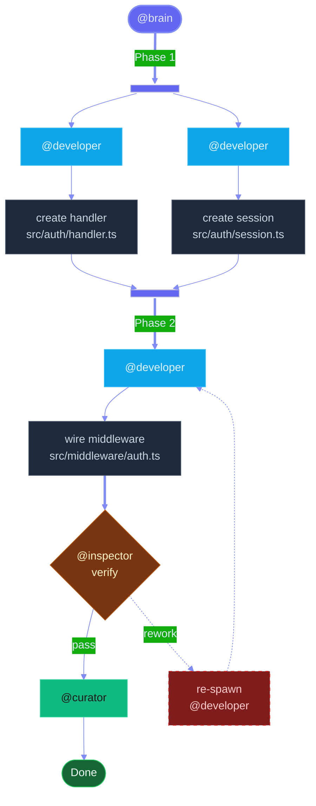
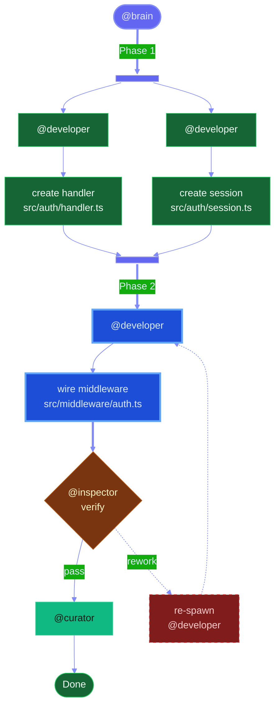
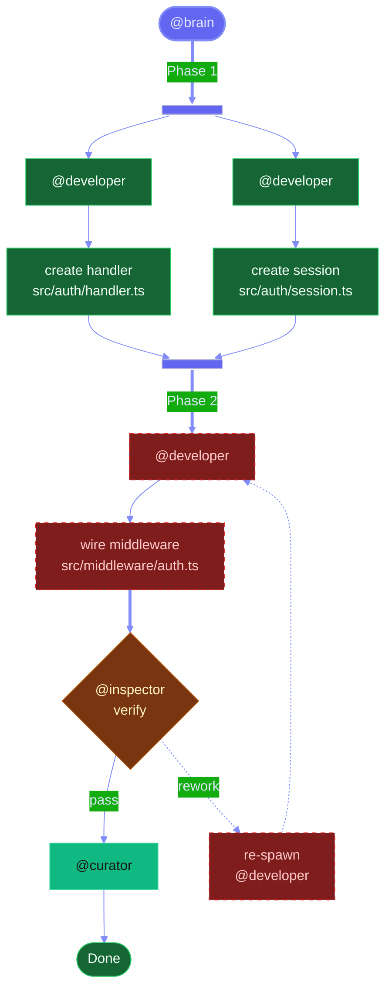

Complete lifecycle example showing both an initial plan diagram (all phases pending) and a progress-updated diagram (mixed statuses). Reference this asset during step 2 to see the living-diagram pattern in practice.

<scenario>

A three-phase implementation plan:

- **Phase 1** `[parallel]` — Two @developer tasks: create auth handler (`src/auth/handler.ts`) and create session module (`src/auth/session.ts`)
- **Phase 2** `[sequential]` — One @developer task: wire auth middleware (`src/middleware/auth.ts`)
- **Phase 3** `[sequential]` — @inspector gate, then @curator for curation

</scenario>

<initial_render>

All phases pending — rendered at plan approval before any work begins. Uses role-based classDefs only (no status overrides).

Observations:

- Every agent node uses its role classDef (`:::developer`, `:::curator`)
- Task nodes use `:::task` for neutral styling
- The rework loop is present but uses `:::rework` class to signal it is a fallback path
- Fork/join bars have `" "` labels (space, not empty string)
- `accTitle` and `accDescr` are present for accessibility

</initial_render>

<progress_update>

After Phase 1 completes and Phase 2 is actively executing — the diagram is re-rendered with status-aware classDefs. Phase 1 nodes turn completed (green), Phase 2 nodes turn active (highlighted blue), and the inspector/curator phases remain in their default role colors since they are pending.

Key differences from the initial render:

- Phase 1 agent and task nodes changed from `:::developer` and `:::task` to `:::completed` — green fill signals finished work
- Phase 2 agent and task nodes changed from `:::developer` and `:::task` to `:::active` — bright blue with thick stroke draws attention to current phase
- Inspector gate and curator retain their role classDefs (`:::gate`, `:::curator`) — gate and terminal nodes do not get status overrides
- Both role-based and status-based `classDef` declarations are present — role classDefs serve nodes that retain their default styling, status classDefs serve nodes that reflect progress
- The `accDescr` is updated to reflect current status: "Phase 1 completed, Phase 2 active, inspector and curator pending"

</progress_update>

<rework_state>

After the inspector returns REWORK NEEDED on Phase 2 — the diagram is re-rendered to show the rework state. Phase 2 nodes switch to rework styling, and the rework loop edge is visually emphasized.

Key differences from the progress update:

- Phase 2 agent and task nodes changed from `:::active` to `:::rework` — dark red dashed stroke signals the inspector sent this phase back
- The rework loop from gate to B3 is now the visually expected path, matching the rework styling on the phase nodes
- `accDescr` updated to reflect rework state

</rework_state>
