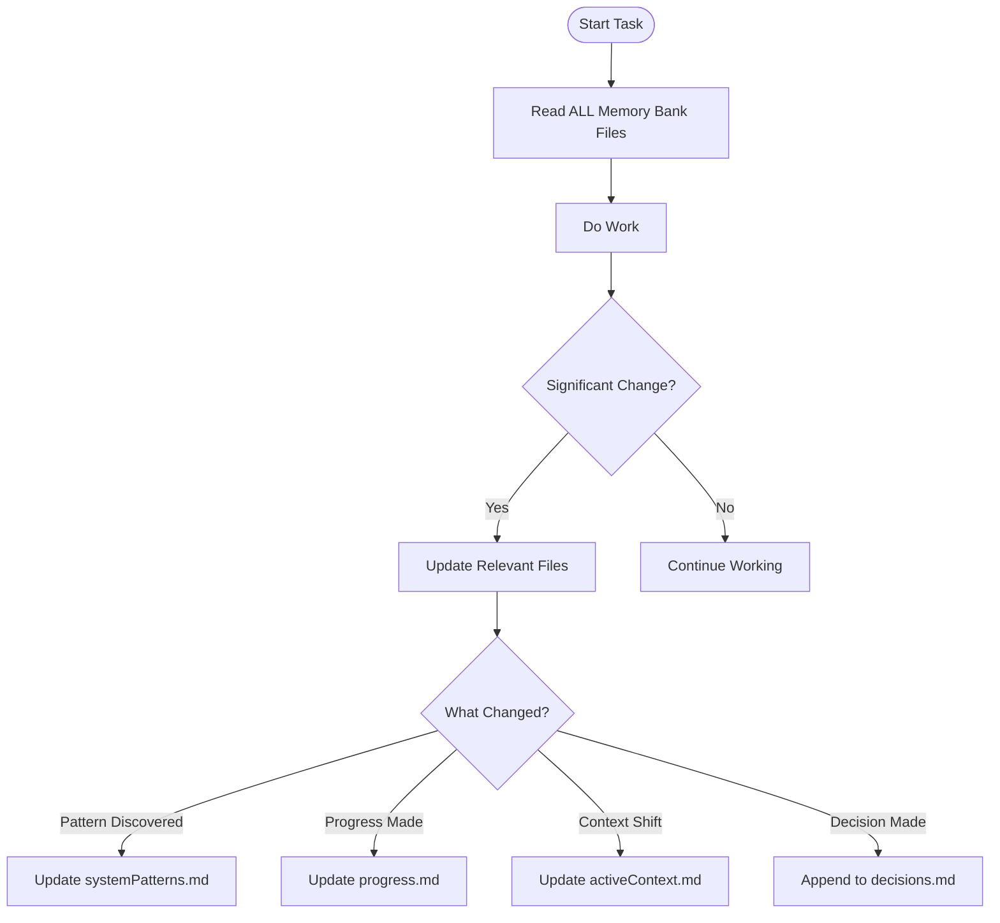

---
when:
  - persisting project context across sessions
  - setting up memory bank directory structure
  - implementing tiered memory architecture
  - tracking project decisions and progress
pairs-with:
  - file-structure
  - session-handoff
  - tiered-memory
  - memory-bank-files
requires:
  - file-write
complexity: high
---

# Memory Bank Schema

Directory structure for persisting project context across sessions. This **community pattern** (originating from [Cline](https://docs.cline.bot/prompting/cline-memory-bank)) provides file-based memory that survives context resets.

> **Note:** As of January 2026, GitHub Copilot has native [Agentic Memory](https://docs.github.com/en/copilot/concepts/agents/copilot-memory) in public preview. The file-based Memory Bank pattern remains valuable for:
> - Cross-tool compatibility (works with Cline, Cursor, Claude Code)
> - Full user control over memory content
> - Version-controlled project context
> - When native memory isn't available or suitable
>
> See [GitHub Agentic Memory](#github-agentic-memory-alternative) section for the native option.

## Location Options

| Location | When to Use |
|----------|-------------|
| `.github/memory-bank/` | Recommended for GitHub Copilot projects |
| `memory-bank/` | Original Cline pattern (project root) |
| `.roo/memory-bank/` | Roo Code compatibility |

## Directory Structure

```
.github/memory-bank/
├── manifest.yaml              # Index + metadata
│
├── global/                    # Project-wide (immutable reference)
│   ├── projectbrief.md        # Core requirements and goals
│   ├── productContext.md      # Why project exists, user needs
│   ├── systemPatterns.md      # Architecture and conventions
│   ├── techContext.md         # Tech stack and constraints
│   └── decisions.md           # ADRs (append-only)
│
├── sessions/
│   ├── _active.md             # Current session state (HOT tier)
│   └── archive/               # Completed sessions (COLD tier)
│       └── 2026-01-23-feature-auth.md
│
├── features/{feature-id}/     # Feature-specific context
│   ├── context.md             # Feature overview
│   ├── progress.yaml          # Task tracking
│   └── decisions.md           # Feature-level decisions
│
└── agents/{agent-id}/         # Agent-specific state
    └── state.yaml             # Agent memory between sessions
```

## Manifest File

> **Extended Pattern:** The manifest file is not part of the original Cline specification but recommended for larger projects needing explicit file indexing.

Index of all memory files with metadata:

```yaml
# manifest.yaml
version: "1.0"
created: "2026-01-15"
updated: "2026-01-23"

files:
  global:
    - path: global/projectbrief.md
      purpose: "Core requirements and project goals"
      update_frequency: "rarely"
    - path: global/productContext.md
      purpose: "Problem space and user context"
      update_frequency: "rarely"
    - path: global/systemPatterns.md
      purpose: "Architecture decisions and patterns"
      update_frequency: "on_architecture_change"
    - path: global/techContext.md
      purpose: "Technology stack and setup"
      update_frequency: "on_tech_change"
    - path: global/decisions.md
      purpose: "Architecture Decision Records"
      update_frequency: "append_only"

  sessions:
    active: sessions/_active.md
    archive_pattern: "sessions/archive/{date}-{topic}.md"

  features:
    pattern: "features/{feature-id}/"

conflict_resolution:
  global_files:
    strategy: "append_only"
    applies_to: ["decisions.md"]
  session_files:
    strategy: "last_write_wins"
  progress_files:
    strategy: "semantic_merge"
    merge_keys: ["task_id"]
```

## Tiered Memory Architecture

> **Extended Pattern:** The tiered architecture adapts concepts from [mem0 research](https://arxiv.org/html/2504.19413v1). The original Cline pattern uses a flat structure with `activeContext.md` for session state.

| Tier | Scope | Lifespan | Location |
|------|-------|----------|----------|
| **Hot** | Current task | In-session | `sessions/_active.md` |
| **Warm** | Recent work | Days | `sessions/archive/{recent}` |
| **Cold** | Historical | Weeks | `sessions/archive/{old}` |
| **Frozen** | Reference | Permanent | `global/*.md` |

## Global Files (6-File Pattern)

The core 6-file pattern from Cline:

### projectbrief.md

```markdown
# Project Brief

## Project Name
Authentication System Rewrite

## Core Requirements
- OAuth2/OIDC support
- MFA enforcement
- Session management

## Goals
- Replace legacy auth by Q2
- 99.9% uptime SLA
- <200ms auth response time

## Scope
### In Scope
- Login/logout flows
- Token management
- User sessions

### Out of Scope
- User profile management
- Billing integration

## Success Criteria
- All existing tests pass
- Performance benchmarks met
- Security audit passed
```

### productContext.md

```markdown
# Product Context

## Why This Project Exists
Legacy auth system has security vulnerabilities and doesn't support modern protocols.

## Problems It Solves
1. Security gaps in password handling
2. No MFA support
3. Session fixation vulnerabilities

## Target Users
- End users: Need secure, fast login
- Developers: Need clear API, good docs
- Security team: Need audit logs, compliance

## User Experience Goals
- Login <2 seconds
- MFA setup <30 seconds
- Clear error messages
```

### systemPatterns.md

```markdown
# System Patterns

## Architecture Overview
```
┌─────────┐     ┌─────────┐     ┌─────────┐
│ Client  │────▶│ Gateway │────▶│  Auth   │
└─────────┘     └─────────┘     │ Service │
                                └────┬────┘
                                     │
                                ┌────▼────┐
                                │   DB    │
                                └─────────┘
```

## Key Technical Decisions
| Decision | Rationale | Date |
|----------|-----------|------|
| JWT tokens | Stateless, scalable | 2026-01-10 |
| Redis sessions | Fast lookup, TTL support | 2026-01-10 |
| bcrypt | Industry standard | 2026-01-10 |

## Design Patterns
- **Repository Pattern:** Data access abstraction
- **Strategy Pattern:** Multiple auth providers
- **Decorator Pattern:** Middleware chain

## Code Conventions
- camelCase for functions
- PascalCase for classes/interfaces
- Feature-based folder structure
```

### techContext.md

```markdown
# Technical Context

## Technologies
| Category | Technology | Version |
|----------|------------|---------|
| Runtime | Node.js | 20.x LTS |
| Framework | Express | 4.18.x |
| Database | PostgreSQL | 16 |
| Cache | Redis | 7.x |
| ORM | Prisma | 5.x |

## Development Setup
1. Clone repository
2. `cp .env.example .env`
3. `docker-compose up -d` (DB, Redis)
4. `npm install`
5. `npm run migrate`
6. `npm run dev`

## Technical Constraints
- Must run in Kubernetes
- Max memory: 512MB per pod
- Response time: <200ms p99
```

### decisions.md (Append-Only)

```markdown
# Architecture Decision Records

## ADR-001: Use JWT for Access Tokens
**Date:** 2026-01-10
**Status:** Accepted

**Context:** Need stateless auth for microservices.

**Decision:** Use JWT with RS256 signing.

**Consequences:**
- (+) Stateless, scalable
- (-) Can't revoke individual tokens
- Mitigation: Short expiry + refresh tokens

---

## ADR-002: Redis for Session Store
**Date:** 2026-01-10
**Status:** Accepted

**Context:** Need fast session lookup with TTL.

**Decision:** Redis Cluster with 15-minute TTL.

**Consequences:**
- (+) Sub-millisecond lookups
- (-) Additional infrastructure
```

## Session Files

### _active.md (Hot Tier)

```markdown
# Active Session
**Updated:** 2026-01-23T14:30:00Z
**Focus:** Implementing refresh token rotation

## Current Task
Adding refresh token rotation to prevent token reuse attacks.

## Completed This Session
- [x] Added refresh token table migration
- [x] Implemented token generation
- [x] Added rotation endpoint

## In Progress
- [ ] Token revocation on rotation
- [ ] Tests for rotation flow

## Blockers
| Issue | Severity | Next Action |
|-------|----------|-------------|
| Redis connection timeout | Medium | Check cluster config |

## Context for Next Session
If resuming: Start with token revocation logic in `src/auth/refresh.ts`.
The rotation endpoint is working but doesn't invalidate old tokens yet.

## Files Modified
- src/auth/refresh.ts
- src/db/migrations/003_refresh_tokens.sql
- tests/auth/refresh.test.ts
```

### Archived Session

```markdown
# Session: 2026-01-22 - JWT Implementation
**Completed:** 2026-01-22T18:00:00Z

## Summary
Implemented JWT access token generation and validation.

## Artifacts Created
- src/auth/jwt.ts
- src/middleware/authenticate.ts
- tests/auth/jwt.test.ts

## Decisions Made
- RS256 for signing (see ADR-001)
- 15-minute access token expiry

## Handoff Notes
JWT implementation complete. Next: refresh tokens.
```

## Feature Folders

```
features/auth-refresh/
├── context.md      # Feature overview
├── progress.yaml   # Task tracking
└── decisions.md    # Feature-specific decisions
```

### Feature context.md

```markdown
# Feature: Refresh Token Rotation

## Overview
Implement secure refresh token rotation to prevent replay attacks.

## Requirements
- Tokens rotate on each use
- Old tokens invalidated immediately
- Grace period for concurrent requests

## Acceptance Criteria
- [ ] Rotation generates new token pair
- [ ] Old refresh token rejected after use
- [ ] 5-second grace period for race conditions
```

### Feature progress.yaml

```yaml
feature_id: auth-refresh
status: in_progress
started: 2026-01-22
target: 2026-01-25

tasks:
  - id: db-migration
    name: "Create refresh_tokens table"
    status: done

  - id: generate
    name: "Implement token generation"
    status: done

  - id: rotate
    name: "Implement rotation logic"
    status: in_progress
    blockers:
      - "Redis timeout issue"

  - id: tests
    name: "Write integration tests"
    status: pending
    depends_on: [rotate]
```

## Agent State

```yaml
# agents/implement/state.yaml
agent_id: implement
last_active: 2026-01-23T14:30:00Z

learned_patterns:
  - "Project uses Prisma for DB access"
  - "Tests use Jest with supertest"
  - "Error responses follow RFC 7807"

active_context:
  feature: auth-refresh
  current_file: src/auth/refresh.ts

preferences:
  verbose_comments: false
  test_style: "describe/it"
```

## Loading Memory in Agents

Reference memory files in agent definitions:

```yaml
---
name: implement
description: Implementation agent with project context
---

## Context Loading
At session start, read:
1. #.github/memory-bank/global/projectbrief.md
2. #.github/memory-bank/global/techContext.md
3. #.github/memory-bank/sessions/_active.md

## Session Management
Before context window fills:
1. Update `sessions/_active.md` with current state
2. Note any decisions in appropriate `decisions.md`
3. Update feature `progress.yaml` if applicable
```

## Update Triggers

When to update memory bank files:



**Trigger events:**
1. **Discovering new project patterns** → `systemPatterns.md`
2. **After implementing significant changes** → `progress.md`, `activeContext.md`
3. **User requests "update memory bank"** → Review ALL files
4. **Context needs clarification** → Relevant context file
5. **Starting new session** → Read ALL, update `activeContext.md`
6. **Making architectural decision** → Append to `decisions.md`

## What Should NOT Be in Memory Bank

- ❌ Sensitive credentials or secrets
- ❌ Large code snippets (use file paths instead)
- ❌ Unfiltered chat transcripts (extract facts instead)
- ❌ Redundant or stale information

## GitHub Agentic Memory (Alternative)

As of January 2026, GitHub Copilot has native memory that works differently from file-based Memory Banks:

| Aspect | File-Based Memory Bank | GitHub Agentic Memory |
|--------|----------------------|----------------------|
| **Storage** | Markdown files in repo | GitHub cloud (repository-scoped) |
| **Maintenance** | Manual updates | Automatic with citations |
| **Verification** | User responsibility | Just-in-time against codebase |
| **Retention** | Permanent (version controlled) | 28-day cycle (refreshed on use) |
| **Sharing** | Via git | Cross-agent (coding, review, CLI) |
| **Control** | Full user control | Limited (opt-in/out only) |
| **Availability** | Any tool | GitHub Copilot surfaces only |
| **Access Required** | Read access | Write permission to repository |
| **Plans** | N/A | Copilot Pro, Pro+, Business, Enterprise |

**Enable Agentic Memory:**
- **Personal:** [github.com/settings/copilot](https://github.com/settings/copilot) → Memory section
- **Organization:** Copilot policy settings → Features → Copilot Memory
- **Repository:** Repository Settings → Copilot → Memory (view/delete only)

**Current Platform Support (Jan 2026):**
- ✅ GitHub website (PRs via Copilot coding agent and code review)
- ✅ Copilot CLI
- ⏳ VS Code integration (coming soon)

**Memory Management:**
- Repository owners can view all stored memories
- Individual memories can be manually deleted
- Memories auto-expire after 28 days if not validated/used

**When to use which:**
- Use **file-based Memory Bank** for cross-tool compatibility, full control, permanent records, VS Code workflows
- Use **GitHub Agentic Memory** for automatic learning, citation-backed memories, less maintenance (GitHub web/CLI)

Source: [GitHub Copilot Memory Documentation](https://docs.github.com/en/copilot/concepts/agents/copilot-memory) | [Enabling Copilot Memory](https://docs.github.com/en/copilot/how-tos/use-copilot-agents/copilot-memory)

## MCP Memory Server

For advanced memory needs, the MCP Memory server provides knowledge graph persistence:

```json
{
  "servers": {
    "memory": {
      "type": "stdio",
      "command": "npx",
      "args": ["-y", "@modelcontextprotocol/server-memory"]
    }
  }
}
```

## Related

- [file-structure](./file-structure.md) — Where memory-bank fits in .github/
- [memory-bank-files](../CONTEXT-MEMORY/memory-bank-files.md) — 6-file templates with update triggers
- [tiered-memory](../CONTEXT-MEMORY/tiered-memory.md) — Hot/Warm/Cold/Frozen patterns
- [conflict-resolution](../CONTEXT-MEMORY/conflict-resolution.md) — Merge strategies
- [session-handoff](../CONTEXT-MEMORY/session-handoff.md) — Cross-session continuity

## Sources

- [Cline Memory Bank](https://docs.cline.bot/prompting/cline-memory-bank) — Original 6-file pattern
- [Cline Blog](https://cline.bot/blog/memory-bank-how-to-make-cline-an-ai-agent-that-never-forgets) — Pattern explanation
- [Tweag Agentic Coding Handbook](https://tweag.github.io/agentic-coding-handbook/WORKFLOW_MEMORY_BANK/) — Copilot adaptation
- [GitHub Copilot Memory](https://docs.github.com/en/copilot/concepts/agents/copilot-memory) — Native memory feature
- [GitHub Blog: Agentic Memory](https://github.blog/ai-and-ml/github-copilot/building-an-agentic-memory-system-for-github-copilot/) — Technical deep-dive
- [mem0 Paper](https://arxiv.org/html/2504.19413v1) — Tiered memory research
- [Roo Code Memory Bank](https://github.com/GreatScottyMac/roo-code-memory-bank) — Community implementation
