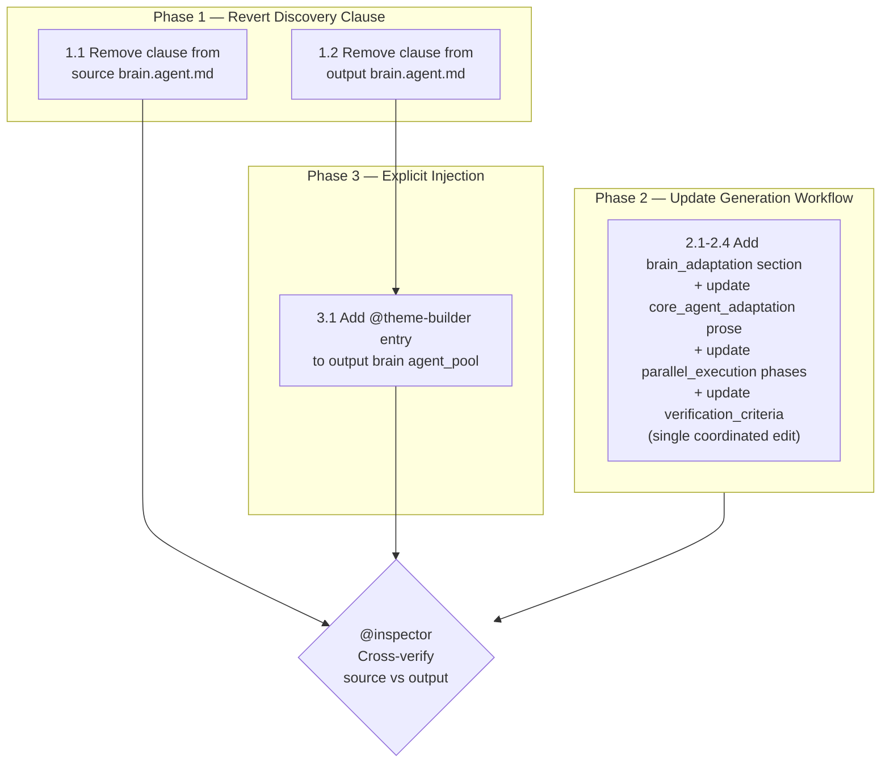

Example of a structured plan for implementing the proposed changes to the agent adaptation process, visualized using Mermaid syntax:

```mermaid
flowchart TD
    subgraph P1["Phase 1 — Revert Discovery Clause"]
        direction LR
        T11["1.1 Remove clause from\nsource brain.agent.md"]
        T12["1.2 Remove clause from\noutput brain.agent.md"]
    end

    subgraph P2["Phase 2 — Update Generation Workflow"]
        T21["2.1-2.4 Add brain_adaptation section\n+ update core_agent_adaptation prose\n+ update parallel_execution phases\n+ update verification_criteria\n(single coordinated edit)"]
    end

    subgraph P3["Phase 3 — Explicit Injection"]
        T31["3.1 Add @theme-builder entry\nto output brain agent_pool"]
    end

    I{"@inspector\nCross-verify\nsource vs output"}

    T11 --> I
    T12 --> T31
    T31 --> I
    P2 --> I
```
